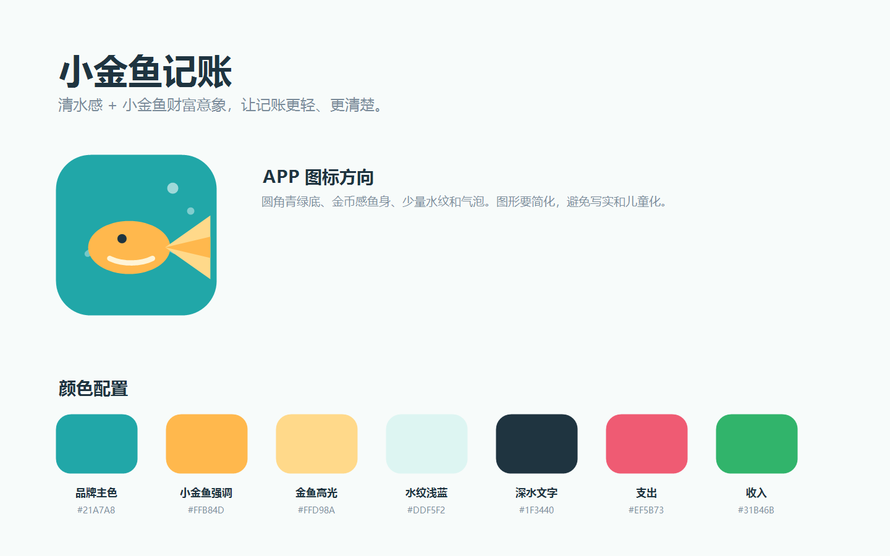
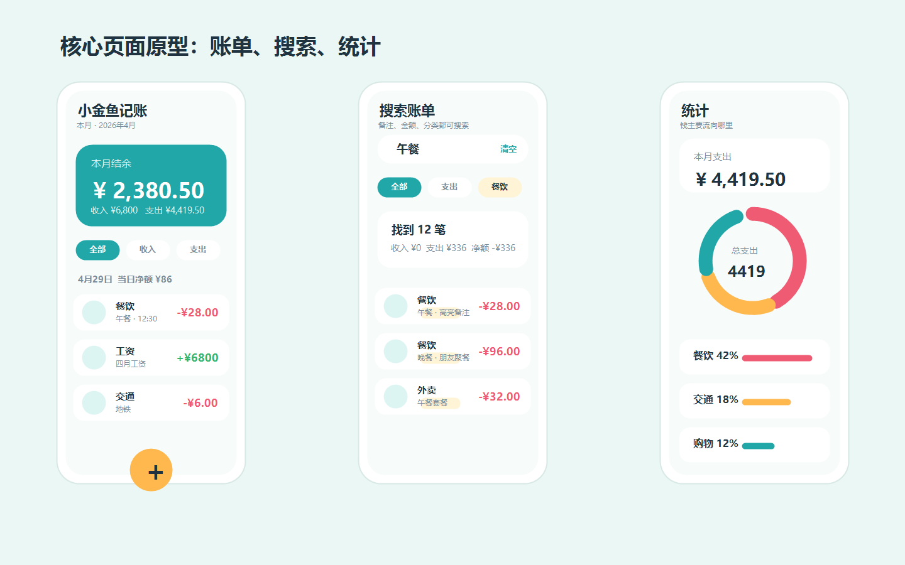
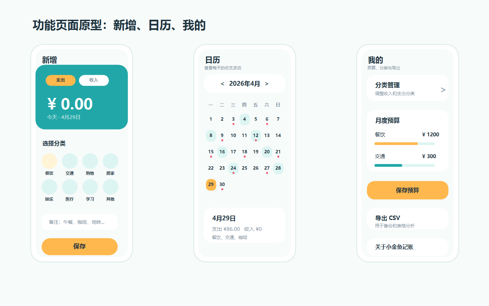

# 小金鱼记账 UI/UX 重新设计文档

> 适用项目：HarmonyOS ArkTS 记账应用  
> 新品牌名：小金鱼记账  
> 设计目标：年轻、清爽、轻量，但保留记账工具的清晰度和效率。

---

## 0. 原型图预览

以下原型图用于统一“小金鱼记账”的视觉方向、页面层级和主要交互布局，后续 ArkUI 实现应优先对齐这些图中的颜色、圆角、信息密度和页面结构。







## 1. 品牌定位

### 1.1 名称

**小金鱼记账**

命名逻辑：

- “金鱼”保留财富、余量、流动感。
- “小”降低传统感，让品牌更年轻、更亲近。
- “记账”明确品类，方便用户第一眼理解用途。

### 1.2 品牌关键词

| 关键词 | 说明 |
| --- | --- |
| 轻松 | 记账不制造压力，减少复杂表格感。 |
| 清楚 | 收入、支出、结余要一眼读懂。 |
| 有余 | 核心心智不是“花了多少”，而是“还剩多少”。 |
| 流动 | 用水、泡泡、游动轨迹表达现金流。 |
| 年轻 | 色彩更明亮，图形更圆润，但不过度幼稚。 |

### 1.3 一句话定位

**让每一笔收支，都游向更有余的生活。**

---

## 2. 视觉语言

### 2.1 核心隐喻

**一条小金鱼在清澈水面里游动，水面代表现金流，金鱼代表财富感和结余感。**

视觉要点：

- 金鱼不是写实动物，使用简化图形。
- 鱼身可以像一枚金币，尾巴像一个勾选符号。
- 水纹用于页面背景、图表辅助线、进度条，不要铺满。
- 气泡可以作为轻装饰，但只出现在空状态、启动页、App 图标局部。

### 2.2 风格边界

应该做：

- 圆润、干净、轻快。
- 明亮背景 + 金色重点。
- 卡片信息密度适中。
- 图表颜色明确，但不要彩虹化。

避免做：

- 传统金色大面积渐变。
- 写实金鱼插画。
- 儿童化卡通表情。
- 大面积深蓝水族馆风格。
- 页面里到处出现鱼形装饰。

---

## 3. 色彩系统

### 3.1 主色板

| 颜色作用 | 色值 | 用途 |
| --- | --- | --- |
| 页面背景 | `#F7FBFA` | 全局底色，偏清水感。 |
| 卡片背景 | `#FFFFFF` | 账单、统计、设置卡片。 |
| 品牌主色 | `#21A7A8` | 顶部、选中态、搜索焦点、主要信息图形。 |
| 金鱼强调色 | `#FFB84D` | 新增按钮、品牌图标、关键操作。 |
| 金鱼高光 | `#FFD98A` | 渐变高光、轻提示。 |
| 水纹浅蓝 | `#DDF5F2` | 背景水纹、筛选底色、空态图形。 |
| 深水文字 | `#1F3440` | 主标题、金额、主要信息。 |
| 次级文字 | `#7A8B99` | 日期、备注、说明文字。 |
| 弱分割线 | `#E7F0EF` | 卡片边界、列表分割。 |
| 收入色 | `#31B46B` | 收入金额、收入柱图。 |
| 支出色 | `#EF5B73` | 支出金额、支出柱图。 |
| 警示色 | `#F59E0B` | 预算预警、超额提示。 |

### 3.2 建议替换 `color.json`

当前文件：[color.json](/D:/HarmonyTest/YaYuSuan/entry/src/main/resources/base/element/color.json)

建议配置：

```json
{
  "color": [
    { "name": "start_window_background", "value": "#F7FBFA" },
    { "name": "color_income", "value": "#31B46B" },
    { "name": "color_expense", "value": "#EF5B73" },
    { "name": "color_primary", "value": "#21A7A8" },
    { "name": "color_surface", "value": "#FFFFFF" },
    { "name": "color_bg", "value": "#F7FBFA" },
    { "name": "color_card", "value": "#FFFFFF" },
    { "name": "color_text_primary", "value": "#1F3440" },
    { "name": "color_text_secondary", "value": "#7A8B99" },
    { "name": "color_divider", "value": "#E7F0EF" },
    { "name": "color_tab_inactive", "value": "#9AAAB5" },
    { "name": "color_accent", "value": "#FFB84D" },
    { "name": "color_duck", "value": "#FFB84D" },
    { "name": "color_pie_water_light", "value": "#DDF5F2" },
    { "name": "color_pie_water_dark", "value": "#21A7A8" }
  ]
}
```

说明：

- `color_duck` 暂时保留字段名，先不大规模改代码引用，值改为金鱼强调色。
- 后续可统一重命名为 `color_goldfish`，但这是第二阶段重构。

---

## 4. App 图标设计

### 4.1 图标概念

**圆形水面 + 一尾小金鱼 + 金币鱼身**

图标结构：

```text
┌────────────────────┐
│  青绿色圆角底        │
│                    │
│     ◜  小气泡       │
│       ◯            │
│    < 金色鱼身 )))   │
│       水纹          │
└────────────────────┘
```

### 4.2 图标元素

| 元素 | 设计要求 |
| --- | --- |
| 背景 | 圆角方形，主色 `#21A7A8`，可加轻微径向亮度。 |
| 鱼身 | 金色椭圆或圆币形，主色 `#FFB84D`。 |
| 鱼尾 | 两片简化三角圆角尾，颜色 `#FFD98A`。 |
| 眼睛 | 一个深色小点，避免表情化。 |
| 水纹 | 1-2 条白色半透明曲线，透明度 40%。 |
| 气泡 | 1-2 个小圆点，白色 60% 透明。 |

### 4.3 图标尺寸规范

| 场景 | 建议 |
| --- | --- |
| `startIcon.png` | 1024 x 1024，透明度全部烘焙到图内。 |
| `foreground.png` | 432 x 432，鱼图形占主体 70%。 |
| `background.png` | 432 x 432，青绿色背景。 |
| SVG 原稿 | 保留为 `icon_goldfish_logo.svg`，方便后续迭代。 |

### 4.4 图标 SVG 原型

建议新增资源：

`entry/src/main/resources/base/media/icon_goldfish_logo.svg`

```svg
<svg width="128" height="128" viewBox="0 0 128 128" fill="none" xmlns="http://www.w3.org/2000/svg">
  <rect width="128" height="128" rx="30" fill="#21A7A8"/>
  <path d="M26 82C42 72 59 72 75 82" stroke="white" stroke-opacity="0.38" stroke-width="6" stroke-linecap="round"/>
  <circle cx="90" cy="36" r="5" fill="white" fill-opacity="0.55"/>
  <circle cx="102" cy="50" r="3" fill="white" fill-opacity="0.45"/>
  <ellipse cx="62" cy="62" rx="28" ry="19" fill="#FFB84D"/>
  <path d="M86 62L105 48V76L86 62Z" fill="#FFD98A"/>
  <path d="M86 62L105 57V67L86 62Z" fill="#FFB84D"/>
  <circle cx="52" cy="57" r="3.5" fill="#1F3440"/>
  <path d="M38 64C45 70 55 72 66 70" stroke="#FFF4D6" stroke-opacity="0.7" stroke-width="4" stroke-linecap="round"/>
</svg>
```

---

## 5. 全局布局规范

### 5.1 页面层级

```text
沉浸式状态栏
页面标题 / 月份切换 / 搜索入口
核心摘要卡片
筛选 / 分段控制
主内容列表或图表
底部 Tab
导航安全区
```

### 5.2 圆角

| 组件 | 圆角 |
| --- | --- |
| 主卡片 | `20vp` |
| 次级卡片 | `16vp` |
| 搜索框 | `18vp` |
| 分类图标容器 | `22vp` 或圆形 |
| 底部 Tab 中间按钮 | 圆形 |
| 弹窗 | `24vp` |

### 5.3 阴影

默认不使用重阴影。

建议：

```ts
.shadow({ radius: 12, color: 'rgba(31, 52, 64, 0.08)', offsetY: 4 })
```

用于：

- 摘要卡片。
- 搜索页结果卡片。
- 底部 Tab。

不用于：

- 每一个列表项都加重阴影。
- 统计明细中的每一行。

### 5.4 字体层级

| 层级 | 字号 | 字重 | 用途 |
| --- | --- | --- | --- |
| 大金额 | `34fp-40fp` | Bold | 首页结余、记账金额输入 |
| 页面标题 | `20fp-22fp` | Bold | 页面顶部标题 |
| 卡片标题 | `16fp-18fp` | Medium/Bold | 支出结构、预算设置 |
| 正文 | `14fp-15fp` | Normal | 分类、备注 |
| 辅助文字 | `11fp-13fp` | Normal | 日期、说明、图例 |

---

## 6. 页面重设计

### 6.1 首页 / 账单页

文件：[BillList.ets](/D:/HarmonyTest/YaYuSuan/entry/src/main/ets/pages/BillList.ets)

页面目标：

- 第一眼看到“本月还剩多少”。
- 快速搜索、快速切月、快速查看每日账单。

布局建议：

```text
┌────────────────────────────┐
│ 小金鱼记账        搜索图标 │
│ 本月 · 2026年4月            │
├────────────────────────────┤
│ 结余摘要卡                 │
│ ¥ 2,380.50                 │
│ 收入 ¥...   支出 ¥...       │
├────────────────────────────┤
│ 月份切换胶囊               │
├────────────────────────────┤
│ 全部 / 收入 / 支出          │
├────────────────────────────┤
│ 4月29日   当日净额          │
│ [账单项]                   │
│ [账单项]                   │
└────────────────────────────┘
```

改造点：

- 顶部品牌从“鸭鱼算”改为“小金鱼记账”。
- 搜索入口放右侧，点击打开独立搜索页。
- 摘要卡片主数字建议改为“结余”，支出/收入作为次级信息。
- 每日分组头使用浅水纹底色 `#DDF5F2`。
- 账单项取消过重阴影，改为轻边框 + 白底。

账单项视觉：

- 左侧分类图标圆底。
- 中间第一行分类，第二行备注 + 时间。
- 右侧金额，收入绿色，支出红色。
- 命中搜索时使用淡黄色背景 `#FFF4D6`。

### 6.2 搜索页

建议新增：[BillSearchPage.ets](/D:/HarmonyTest/YaYuSuan/entry/src/main/ets/pages/BillSearchPage.ets)

页面目标：

- 独立展开，不干扰账单页浏览。
- 支持关键词、分类、类型、时间范围筛选。
- 搜索结果对“备注、金额、分类”高亮。

布局建议：

```text
┌────────────────────────────┐
│ 返回  搜索框          清空 │
├────────────────────────────┤
│ 全部 / 收入 / 支出          │
│ 时间：全部时间 / 自定义     │
│ 分类：全部分类 / 餐饮       │
├────────────────────────────┤
│ 找到 12 笔                 │
│ 收入 ¥... 支出 ¥... 净额... │
├────────────────────────────┤
│ [搜索结果项，高亮命中字段]  │
└────────────────────────────┘
```

搜索匹配：

| 字段 | 规则 |
| --- | --- |
| 备注 | 包含关键词，高亮命中片段。 |
| 分类 | 包含关键词，高亮命中片段。 |
| 金额 | 输入数字匹配展示金额，例如 `12` 匹配 `12.00`。 |

高亮样式：

- 字段命中：浅金底 `#FFF4D6`。
- 文字命中：深水文字 `#1F3440` + Medium。
- 金额命中：金额右侧加浅金小标记。

### 6.3 记账页

文件：[AddBill.ets](/D:/HarmonyTest/YaYuSuan/entry/src/main/ets/pages/AddBill.ets)

页面目标：

- 保持“快速记一笔”。
- 金额输入是视觉中心。

布局建议：

```text
青绿顶部水面区
收入 / 支出分段切换
¥ 0.00
日期胶囊

白底内容区
分类网格
备注输入
保存按钮
```

改造点：

- 顶部背景从纯黄或深色改为主色青绿。
- 金额输入区域用金鱼强调色作为光标和底部焦点线。
- 保存按钮使用 `#FFB84D`，文字用深水色。
- 分类选中态：图标底色使用分类色，外圈加金色描边。

### 6.4 日历页

文件：[Calendar.ets](/D:/HarmonyTest/YaYuSuan/entry/src/main/ets/pages/Calendar.ets)

页面目标：

- 看每日收支波动。
- 用水位感表达当日支出。

布局建议：

- 月份选择保持胶囊。
- 日期格子使用浅水背景。
- 有账单日期显示小圆点：
  - 收入：绿色点。
  - 支出：红色点。
  - 同时有收支：双色半圆点。
- 选中日期使用金鱼强调色边框。

### 6.5 统计页

文件：[Statistics.ets](/D:/HarmonyTest/YaYuSuan/entry/src/main/ets/pages/Statistics.ets)

页面目标：

- 让用户看清“钱主要流向哪里”。

布局建议：

```text
月份选择
摘要卡片
支出结构 / 收支趋势

环形图卡片
分类明细进度条
```

图表规范：

- 饼图使用环形，不用实心饼。
- 中心显示“总支出”和金额。
- 柱状图只保留必要网格线。
- 图例字号必须不低于 `13fp`。
- Canvas 字体不要随视口无限缩放，使用固定可读字号。

颜色：

- 收入柱：`#31B46B`
- 支出柱：`#EF5B73`
- 其他分类：从青绿、金色、水蓝、珊瑚红中取低饱和组合。

### 6.6 设置页

文件：[Settings.ets](/D:/HarmonyTest/YaYuSuan/entry/src/main/ets/pages/Settings.ets)

页面目标：

- 管理预算、分类、导出。
- 不做复杂视觉，只要清晰。

布局建议：

```text
设置
┌ 分类管理        > ┐
┌ 月度预算          ┐
│ 餐饮  ¥...        │
│ 交通  ¥...        │
└──────────────────┘
保存预算
导出 CSV
关于小金鱼记账
```

改造点：

- 分类管理入口使用图标 + 标题 + 副标题。
- 预算输入框右对齐，金额旁使用小金币点缀。
- 超预算分类显示浅红背景或红色进度条。

---

## 7. 核心组件规范

### 7.1 Bottom Tab

当前文件：[Index.ets](/D:/HarmonyTest/YaYuSuan/entry/src/main/ets/pages/Index.ets)

设计建议：

- 中间“记账”按钮保留突出。
- 中间按钮改为金鱼强调色 `#FFB84D`。
- 选中 Tab 使用主色 `#21A7A8`。
- 未选中使用 `#9AAAB5`。
- Tab 背景白色，顶部加轻分割线。

Tab 文案：

| 当前 | 建议 |
| --- | --- |
| 账单 | 账单 |
| 日历 | 日历 |
| 记账 | 新增 |
| 统计 | 统计 |
| 设置 | 我的 |

### 7.2 SummaryCard

当前文件：[SummaryCard.ets](/D:/HarmonyTest/YaYuSuan/entry/src/main/ets/components/SummaryCard.ets)

建议：

- 主标题改为“本月结余”。
- 大金额显示结余。
- 收入和支出作为底部两个指标。
- 背景用青绿到浅水蓝的轻渐变。
- 金鱼高光色只用于小标签或重点数字，不大面积铺满。

### 7.3 BillItem

当前文件：[BillItem.ets](/D:/HarmonyTest/YaYuSuan/entry/src/main/ets/components/BillItem.ets)

建议：

- 高度保持 `68vp-76vp`。
- 左侧图标圆底 `44vp`。
- 备注为空时显示时间，不要留空。
- 右侧金额不使用花体，改用清晰 Bold。
- 右滑删除保持红色，但图标换成删除符号资源。

### 7.4 CategoryGrid

当前文件：[CategoryGrid.ets](/D:/HarmonyTest/YaYuSuan/entry/src/main/ets/components/CategoryGrid.ets)

建议：

- 4 列保留。
- 图标圆底从 `44vp` 增加到 `48vp`。
- 选中态加金色描边。
- 分类文字 `12fp`，最多一行。

---

## 8. 文案替换

| 旧文案 | 新文案 |
| --- | --- |
| 鸭鱼算 | 小金鱼记账 |
| 记账 | 新增 |
| 保存账单 | 保存 |
| 本月支出 | 本月结余 |
| 分类支出占比 | 支出结构 |
| 最近 6 个月收支趋势 | 近 6 月趋势 |
| 还没有账单记录 | 还没有记录 |
| 点击下方「记账」开始记录 | 点一下中间按钮，记一笔 |
| 暂无数据 | 还没有数据 |
| 导出全部账单（CSV） | 导出 CSV |

---

## 9. 资源命名建议

### 9.1 新增资源

```text
entry/src/main/resources/base/media/icon_goldfish_logo.svg
entry/src/main/resources/rawfile/icon_search.svg
entry/src/main/resources/rawfile/icon_delete.svg
entry/src/main/resources/rawfile/icon_filter.svg
entry/src/main/resources/rawfile/icon_coin.svg
entry/src/main/resources/rawfile/icon_bubble.svg
```

### 9.2 旧资源处理

| 旧资源 | 处理 |
| --- | --- |
| `icon_duck_logo.svg` | 保留一版，后续不再引用。 |
| `icon_duck_add.svg` | 替换为 `icon_goldfish_add.svg` 或复用 `icon_tab_add.svg`。 |
| `color_duck` | 第一阶段只改色值，第二阶段再重命名。 |

---

## 10. 落地顺序

### 第一阶段：品牌和基础视觉

1. 替换应用名：`小金鱼记账`。
2. 更新 `color.json`。
3. 新增 App 图标 SVG 原稿。
4. 替换启动图和桌面图标。
5. 修改账单页标题、底部 Tab 文案。

### 第二阶段：核心页面重构

1. 重构 `SummaryCard` 为“本月结余”。
2. 重构 `BillList` 顶部和账单项样式。
3. 统一 `MonthSelector` 风格。
4. 更新 `AddBill` 顶部输入区。

### 第三阶段：统计和搜索

1. 固定 Canvas 图表字体字号，不做过度缩放。
2. 统一统计卡片、图表和明细列表样式。
3. 新增独立搜索页。
4. 搜索结果支持备注、分类、金额高亮。

### 第四阶段：设置和细节

1. 重构设置页列表样式。
2. 分类管理页统一图标选中态。
3. 空状态增加小金鱼插图。
4. 清理旧鸭子命名和资源。

---

## 11. 验收标准

### 视觉验收

- 首屏能明确识别“小金鱼记账”。
- 主色不再偏鸭黄色，整体转为青绿水感 + 金鱼强调。
- 每个页面最多一个强强调色区域。
- 金额、日期、分类、备注层级清楚。

### 功能验收

- 账单、新增、日历、统计、设置五个 Tab 不丢功能。
- 所有金额颜色仍正确区分收入和支出。
- 图表文字清晰可读。
- 深浅背景下文字对比度足够。

### 代码验收

- 所有颜色优先引用 `$r('app.color.xxx')`。
- Canvas 内部颜色允许硬编码，但要统一到本规范色值。
- 旧资源不删除，确认无引用后再清理。
- 不一次性重命名所有 `duck` 字段，避免引入大面积回归。

---

## 12. 最终设计总结

**小金鱼记账** 应该是一个“清水感 + 小金鱼财富意象”的年轻记账应用。

它的核心体验不是复杂的财务系统，而是：

- 快速记一笔。
- 看清这个月还剩多少。
- 找到钱主要流向哪里。
- 用轻松但清楚的方式管理预算。

视觉上，青绿负责清爽和秩序，金色负责品牌记忆点，红绿负责收支语义。金鱼只作为品牌符号点到为止，页面本身仍然以信息清晰为第一优先级。
